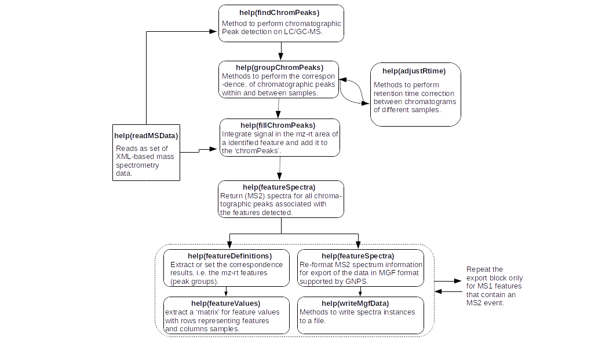

## Introduction

Feature-Based Molecular Networking (FBMN) is a computational method that bridges popular mass spectrometry data processing tools and molecular networking analysis on [GNPS](http://gnps.ucsd.edu). The tools supported are: [MetaboScape4.0](https://www.bruker.com/products/mass-spectrometry-and-separations/ms-software/metaboscape/overview.html), [MS-DIAL](http://prime.psc.riken.jp/Metabolomics_Software/MS-DIAL/), [MZmine2](https://mzmine.github.io/), [OpenMS](https://www.openms.de/), and [XCMS3](https://github.com/sneumann/xcms).

The main documentation for Feature-Based Molecular Networking can be accessed [here](featurebasedmolecularnetworking)

The Feature-Based Molecular Networking workflow on GNPS can be accessed [here](https://gnps.ucsd.edu/ProteoSAFe/index.jsp?params=%7B%22workflow%22:%22FEATURE-BASED-MOLECULAR-NETWORKING%22,%22library_on_server%22:%22d.speclibs;%22%7D) (you need to be logged in GNPS first).

Below follows a description on how to use XCMS3 with the FBMN workflow in GNPS.

## Mass spectrometry processing with XCMS3

Install the latest version of XCMS3 from [Bioconductor](https://www.bioconductor.org/packages/release/bioc/html/xcms.html) or [https://github.com/sneumann/xcms](https://github.com/sneumann/xcms).

### Citations and development

This work builds on the efforts of our many collaborattors, please cite their work:

[https://github.com/sneumann/xcms](https://github.com/sneumann/xcms)

Benton, H.P., Wong, D.M., Trauger, S.A., Siuzdak, G. [XCMS2: Processing Tandem Mass Spectrometry Data for Metabolite Identification and Structural Characterization.](https://pubs.acs.org/doi/abs/10.1021/ac800795f) Analytical Chemistry 80, 6382-6389 (2008).

Smith, C.A., Want, E.J., O'Maille, G., Abagyan,R., Siuzdak, G. [XCMS: Processing mass spectrometry data for metabolite profiling using nonlinear peak alignment, matching and identification.](https://pubs.acs.org/doi/10.1021/ac051437y) Analytical Chemistry, 78, 779–787 (2006).

### Mass Spectrometry Data Processing with XCMS3

As for all preprocessing software tools, a sequence of steps is performed to process mass spectrometry data in XCMS3. Here we will present key steps required to process untargeted LC-MS/MS data collected using data dependent acquisition. An example step-by-step guide is accessible as [Jupyter notebook or R markdown documents](https://github.com/DorresteinLaboratory/XCMS3_FeatureBasedMN).

**IMPORTANT:** XCMS3 parameters will vary depending on the mass spectrometer, the acquisition parameters, and the samples investigated. The following documentation serves as a basic guideline for using XCMS3 with the Feature-Based Molecular Networking workflow.

Please consult these resources for more details on XCMS3 processing:

- The official [XCMS3 tutorial](https://www.bioconductor.org/packages/release/bioc/vignettes/xcms/inst/doc/xcms.html) 
- The video tutorial about [XCMS3 processing for Feature Based Molecular Networking](tutorials/americangutxcms3/).

### Convert your LC-MS/MS Data to an Open Format
XCMS3 accepts different input formats. Note that we recommand to first convert your files to the mzML format before using XCMS3 for processing. [See the documentation here](https://ccms-ucsd.github.io/GNPSDocumentation/fileconversion/).

### Using XCMS3

Before we can use XCMS3 R package we need to install R. Windows users can [download it here](https://cran.r-project.org/bin/windows/base/) and Mac OS users can [download it here](https://cran.r-project.org/bin/macosx/).

R can be used on the terminal, with  [RStudio](https://www.rstudio.com/products/RStudio/) or [Jupyter](https://cran.r-project.org/bin/macosx/), see ANACONDA documentation for a [user friendly installation](https://docs.anaconda.com/anaconda/navigator/tutorials/r-lang/). Once R is installed and one's favorite to interact with it is chosen, one can be easily installed as [shown above](#mass-spectrometry-processing-with-xcms3)

#### Processing Steps

The XCMS3 is a very popular R package with a large user base and very good community support. Here we are going to explore some basic processing features of the package with the [tutorials described above](https://github.com/DorresteinLaboratory/XCMS3_FeatureBasedMN) performing the processing described in the workflow figure below:

##### Submit the files needed for Feature-Based Molecular Networking to GNPS:

After the completion of the workflow described above, the user can proceed to [Feature-Based Molecular Networking (FBMN)](featurebasedmolecularnetworking.md) with the files:

- a feature table with ion intensities (.CSV file format)

- a list of the MS/MS spectra (.MGF file format) (the most intense MS/MS per feature is selected).

generated with the workflow above.

##### The files can be uploaded to the GNPS web-platform and a Feature-Based Molecular Networking job can be directly launched

**IMPORTANT:** While the possibility to submit the files directly to GNPS and launch a FBMN job on the fly is really convenient for quick data analysis, the job and files will not be saved to your personal account on GNPS, and you are limited to basic presets of parameters. For that reason, we recommend to upload your files with the FTP uploader [see documentation](https://ccms-ucsd.github.io/GNPSDocumentation/fileupload/) and prepare your job [directly on GNPS](https://gnps.ucsd.edu/ProteoSAFe/index.jsp?params=%7B%22workflow%22:%22FEATURE-BASED-MOLECULAR-NETWORKING%22,%22library_on_server%22:%22d.speclibs;%22%7D) (you must be logged in first).

### Feature Based Molecular Networking in GNPS

The workflow for Feature Based Molecular Networking in GNPS is different from the classical molecular networking workflow. [Access the FBMN workflow here](https://gnps.ucsd.edu/ProteoSAFe/index.jsp?params=%7B%22workflow%22:%22METABOLOMICS-SNETS-MZMINE%22,%22library_on_server%22:%22d.speclibs;%22%7D) (You need to be logged in first !).

More information on the Feature Based Molecular Networking workflow on GNPS can be obtained at [this documentation page](featurebasedmolecularnetworking).

Test files are accessible [here](https://github.com/CCMS-UCSD/GNPSDocumentation/tree/master/docs/tutorials/AG_tutorial_files):

1. Feature Table from above
2. MGF for MS/MS from above
3. Metadata table - described [here](networking#metadata)

Here is an example XCMS3 networking [job](https://proteomics2.ucsd.edu/ProteoSAFe/status.jsp?task=678bbfaec3e44c6a9ead6a5f14b3a08c) from a subset of the American Gut Project.

## Tutorials

See our [XCMS3 tutorial](https://github.com/DorresteinLaboratory/XCMS3_FeatureBasedMN/) on using Feature Based Molecular Networking for the American Gut Project sample.
